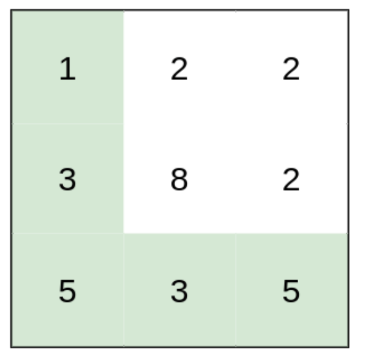
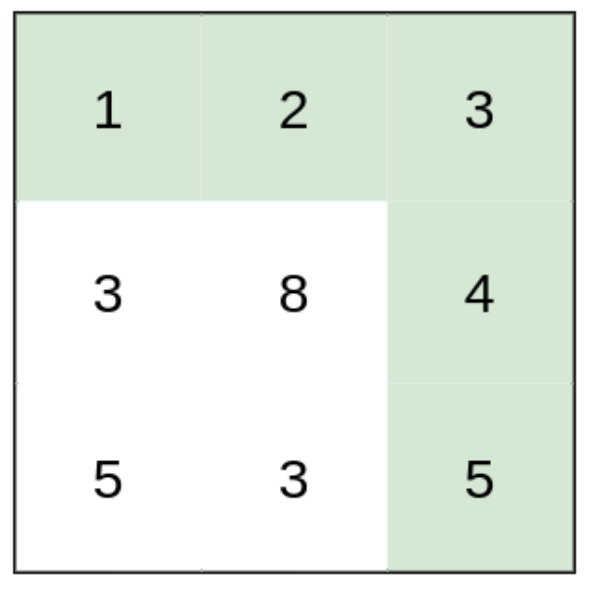
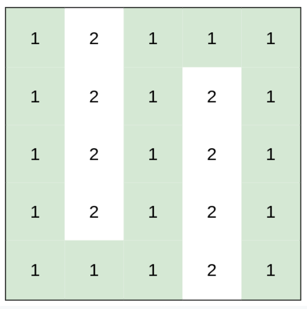

# Sorted Array to Binary Search Tree
An exercise working with Binary Search Trees

## Exercise
Given a 2D array of size rows x columns, where heights[row][column] represents the height of cell (row, column). 

You are situated in the top-left call (0, 0) and are travelling to the bottom-right cell, (rows - 1, columns - 1). You can move up, down, left, or right (not diagnol) and wish to find the route that requires the minimum effort. 

A route's effort is the maximum absolute difference in heights between two consecutive cells of the route.

For instance, imagine you are riding a bike from one part of your city to another part of your city. If there's a route with an elevation change of maximum of 3 feet and a route with a maximum elevation change of 30 feet, the minimum effort path would be the route with a maximum elevation change of 3 feet. In this case, we would return the int 3 as our result for the minimum effort path.

## Examples

### Example #1


*Input:* heights = [
    [1, 2, 2],
    [3, 8, 2],
    [5, 3, 5]
]
<br>
*Output:* 2
<br>
*Explanation:* The route (highlighted in green) of [1, 3, 5, 3, 5] has a maximum absolute difference of 2 in consecutive cells.

Notice the route from [1, 2, 2, 2, 5] has a maximum absolute difference of 3, so it is not the optimal route in this case.

### Example #2

*Input:* heights = [
    [1, 2, 3],
    [3, 8, 4],
    [5, 3, 5]
]
<br>
*Output:* 1
<br>
*Explanation:* The route of [1, 2, 3, 4, 5] (highlighted in green) has a maximum absolute difference of 1 in consecutive cells, which is better than the route [1, 3, 5, 3, 5], which has a maximum absolute difference of 2.

### Example #3

*Input:* heights = [
    [1,2,1,1,1],
    [1,2,1,2,1],
    [1,2,1,2,1],
    [1,2,1,2,1],
    [1,1,1,2,1]
]
<br>
*Output:* 0
<br>
*Explanation:* The route requires `0` effort due to the fact that the path highlighted (all 1's) has a maximum absolute difference of 0 between cells.

## Hints
A modified version of Dijkstra may be used here where the effort is the difference between two heights, as opposed to the cumulation of the edge cost between nodes.

## Leetcode Link
https://leetcode.com/problems/path-with-minimum-effort/

## Getting Started

As usual with a python project, create a virtual environment:

```
python3 -m venv venv
```

Then activate the virtual environment

```
source venv/bin/activate
```

Then install the required packages.

```
pip install -r requirements.txt
```